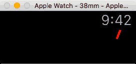

# About

This WatchOS 2.0 App demonstrates the use of CoreGraphics
to draw dynamic graphs on Apple Watch.

# To Build

 1. Open the `ExampleWatchGraph.xcodeproj` using the XCode.
 2. Configure the `Product → Scheme` to `ExampleWatchGraph WatchKit App`
 3. Run `⌘R`.

